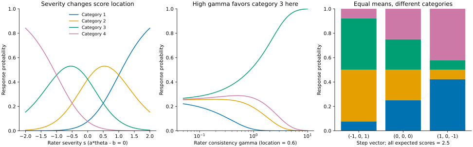
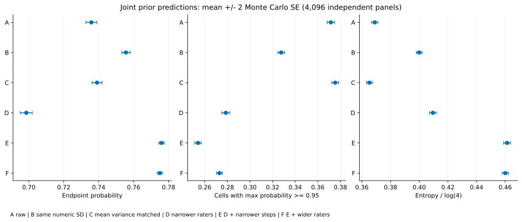
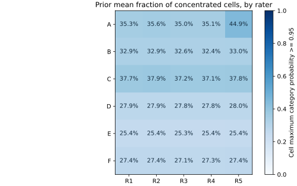

# MGMFRMの事前尺度から評定確率へ

2026-09-24。**事前の選択では、評定者の交換可能性、得点の向きに関する対称性、カテゴリー別の予測を別々に確認する必要がある。** 同じ数値のSDを入れた比較と、平均分散を揃えた比較では答えが変わる。さらに、ステップの分散を小さくすると、一つのカテゴリーへの極端な集中は減る一方、両端カテゴリーの合計確率は増える条件を確認した。「分散を小さくすれば妥当になる」という選び方はできない。

今回は6条件の事前予測と決定的な数式・実装照合を行った。**科学的なSDの採用、既定値・公開APIの変更、事後推定は行っていない。** 実データは使わず、元のraw cohortは完了4・失敗1・未着手269のまま保持した。

## 1. 問いと比較の役割

[事前選択の整理](mgmfrm-prior-choice.md)では、raw、normalized exchangeable、normalized sourceの分布・尺度・役割を区別した。今回は次の問いを扱う。

1. 厳しさの差、一貫性の比、ステップの幅は、応答確率のどの性質を変えるか。
2. rawからexchangeableへ移る比較で、平均分散を揃えても残る違いは何か。
3. 個別対比の幅を狭めたとき、人物・項目も含む共同事前の予測はどう変わるか。

最初は他の要因を固定した計算で仕組みを確認し、次に全パラメータを共同事前から生成する。後者だけでは複数ブロックの寄与を分けられないため、両者を組み合わせる。sourceは指定評定者を持つ原典参照という別の役割があり、今回の6条件には含めない。

この比較は事前が許す評定の点検である。特定のデータへの適合、推定器の回復・被覆、MGMFRM全体の受入を問う実験ではない。

## 2. 一要因を動かしたときの意味

カテゴリーを1,…,4と表し、`eta=a_i theta_pd-b_i-s_r` とする。隣接カテゴリーのlog oddsは、

```math
\log\frac{P(Y=h+1)}{P(Y=h)}=1.7\gamma_r(\eta-\tau_{ih}),\quad h=1,2,3.
```

### 厳しさ：得点の位置を動かす

厳しさをδ増やすと、各隣接log oddsは `−1.7 gamma_r delta` だけ変化する。γ=1、δ=0.5なら、上位／下位カテゴリーの隣接oddsは約0.4274倍になる。同じ厳しさ差でもγが異なれば確率への影響は異なる。δだけから一律の得点差へ換算することはできない。

### 一貫性：条件付き確率の集中を変える

他のパラメータが有限で固定されていると、γ→0で4カテゴリーの確率は各1/4へ近づく。γ→∞では累積logitが最大のカテゴリーに集中し、最大が複数ならその間に等分される。必ず最高得点へ集中するわけではない。図の `eta=0.6, step=(-1,0,1)` ではカテゴリー3へ集中する。

従ってこのγを、外的基準との正確さや一般的な信頼性係数と同一視しない。ここで確認するのは、モデルが表す条件付き評定の鋭さである。

### ステップ：平均得点が同じでもカテゴリー使用を変える

η=0、γ=1とした場合を比べる。

| ステップ | カテゴリー1 | 2 | 3 | 4 | 両端の合計 | 期待得点 |
| --- | ---: | ---: | ---: | ---: | ---: | ---: |
| (−1,0,1) | 0.0772 | 0.4228 | 0.4228 | 0.0772 | 0.1545 | 2.5 |
| (0,0,0) | 0.2500 | 0.2500 | 0.2500 | 0.2500 | 0.5000 | 2.5 |
| (1,0,−1) | 0.4228 | 0.0772 | 0.0772 | 0.4228 | 0.8455 | 2.5 |

最初と最後は和も二乗和も同じである。一般に `(−h,0,h)` の非正規化確率は `(1,e^(1.7h),e^(1.7h),1)` なので、両端の合計は `1/(1+e^(1.7h))`。逆順なら符号が逆になる。期待得点やステップ分散だけの報告では、この違いを失う。



図はカテゴリーを同じ4色で区別する。評定者パラメータを動かす例は、別の評定者を補償的に動かして制約を保った完全デザインへ埋め込み、Juliaでも照合した。モデルはステップの単調順序を制約していない。用途から順序や非ゼロの中心を要求するなら、それは別の事前設計である。

## 3. 共同事前比較の設計

50人×5項目×5評定者、4カテゴリーの完全交差を使う。純粋QはI1,I2が次元1、I3,I4,I5が次元2。人物は各次元で独立 `N(0,1)`、項目位置は `N(0,1)`、log負荷量は `N(0,0.5²)` とし、全条件で同じ生成値を使う。固定係数は1.7。評定者厳しさとlog一貫性、および各項目の3ステップにゼロ和制約を課す。

以下の数値は例示であり、用途から確定した推奨範囲ではない。rawのσは独立自由座標のSD、exchangeableのτはkernel SDである。

| 条件 | 構造と比較目的 | 厳しさσ/τ | log一貫性σ/τ | ステップσ/τ |
| --- | --- | ---: | ---: | ---: |
| A | 現行rawの計算参照 | 1 | 0.5 | 1 |
| B | exchangeable、Aと同じ数値 | 1 | 0.5 | 1 |
| C | exchangeable、各制約ブロックの平均分散をAと一致 | √2 | √2/2 | √2 |
| D | Cから評定者の幅を狭める | 0.180388 | 0.250070 | √2 |
| E | Dからステップの幅も狭める | 0.180388 | 0.250070 | 0.360775 |
| F | Eから評定者の幅を広げる | 0.360775 | 0.500141 | 0.360775 |

D,Eは一つの厳しさ差の中央95%区間が±0.5、一つの一貫性比が[1/2,2]になる設定。E,Fは同じ項目の一つのステップ差が95%で±1内となる設定。Fの評定者幅は厳しさ±1、一貫性比[1/4,4]である。全て `tau=幅/(sqrt(2) z_0.975)`、比の場合は幅をlogに変換して求めた。

Cは平均周辺分散と全対比の平均分散をAと揃える。個別の分散・共分散、γの算術平均や裾まで一致させた条件ではない。C→DとE→Fは厳しさ・log一貫性の両方を変えるため、そのどちらか一方の効果には分解しない。D→Eはステップ事前だけを変える。

### 計算と不確実性

- **各条件4,096パネル。** 一つのパネルは人物・項目・評定者の全パラメータの共同事前標本である。パネル間は独立、条件間は共通の標準正規乱数で対応づける。6条件を合算した24,576件の独立研究とは扱わない。
- **平均の単位を揃える。** 人物・次元を等重みとし、各次元の中で項目・評定者を等重みにする。項目数が2対3でも次元重みは各1/2。評定者別も同じ次元重みで集計する。
- **応答はサンプリングしない。** 各パネルの1,250セルについてカテゴリー確率を計算する。期待得点・両端確率・正規化entropy・最大確率≥0.95のセル割合を集計する。0.95は記述指標の定義で、受入閾値ではない。
- **MCSEはパネルを単位にする。** 各パネルの集計値の標本SDを√4096で割る。条件差は対応するパネルの差から計算する。1,250セルは共有パラメータを持つため、独立反復数へ加えない。

4,096は記述的な事前平均の分解能から選んだ。範囲[0,1]の指標なら真の平均のMonte Carlo標準誤差は最大0.5/√4096≈0.78ポイント。対応差は範囲[−1,1]なので最大1/√4096≈1.56ポイント。実際の標本から求めたMCSEは下表のように小さい。これらは科学的許容誤差や稀事象の相対精度を保証する条件ではない。

実行前の[plan.json](../../results/workflows/20260924-prior-response-01/plan.json)に6条件・seed・集計方法・照合標本番号・コードハッシュを保存した。ローカルの実行計画であり、外部登録された研究計画ではない。

## 4. 結果：何が変わり、何が変わらないか

表の括弧内は**平均のMCSE**。パネル自体のばらつきでも、事後の信用区間でもない。確率とセル割合は%で示す。

| 条件 | 両端カテゴリーの合計確率 % | 最大確率≥0.95のセル割合 % | entropy/log(4) | 期待得点 |
| --- | ---: | ---: | ---: | ---: |
| A | 73.58 (0.16) | 37.16 (0.16) | 0.3690 (0.0011) | 2.5130 (0.0043) |
| B | 75.56 (0.12) | 32.76 (0.15) | 0.4000 (0.0010) | 2.5027 (0.0046) |
| C | 73.91 (0.14) | 37.54 (0.15) | 0.3653 (0.0010) | 2.5020 (0.0041) |
| D | 69.86 (0.17) | 27.87 (0.18) | 0.4096 (0.0012) | 2.5036 (0.0052) |
| E | 77.60 (0.08) | 25.41 (0.14) | 0.4613 (0.0012) | 2.5055 (0.0055) |
| F | 77.50 (0.07) | 27.30 (0.13) | 0.4601 (0.0011) | 2.5052 (0.0053) |



図の横線は±2 MCSEという近似的・個別のMonte Carlo分解能の表示であり、同時保証を持つ検定ではない。

### 同じ数値のSDと、平均分散を揃えたSDでは結論が違う

B−Aでは、最大確率≥0.95のセル割合が **−4.397ポイント、MCSE 0.131ポイント**。一方、平均分散を揃えたC−Aでは **+0.382ポイント、MCSE 0.138ポイント**だった。同じ数値でexchangeableへ替えたときの集中の減少を、交換可能性そのものの一律の効果と解釈できない。

AとCの全体平均が近くても、評定者別の扱いは異なる。Aの最後に再構成されるR5は44.87%、他4人は平均35.23%で、差は **9.645ポイント、MCSE 0.648ポイント**。Cでは各評定者が約37–38%である。exchangeableでの等しさは有限標本の数字が一致したという主張ではなく、分布の置換対称性から従う。共通平均だけではrawの評定者ラベル依存を発見できない。



### ステップ縮小と両端への集中は同じ方向に動かない

D→Eではステップ事前だけを狭めた。

| E−D | 差 | 差のMCSE |
| --- | ---: | ---: |
| 両端カテゴリーの合計確率 | +7.743ポイント | 0.116ポイント |
| 最大確率≥0.95のセル割合 | −2.460ポイント | 0.097ポイント |
| entropy/log(4) | +0.05178 | 0.00070 |

一つのカテゴリーに極端に確率が偏るセルは減り、平均entropyは上がる。それでも両端カテゴリーの合計確率は増える。このモデルでは、ステップを0近くへ寄せることはηを0へ寄せることではない。ηの正負に応じた両端への傾きが残り、離れたステップが中央カテゴリーに与えていた確率も変わる。第2節の固定条件の計算が、その区別を説明する。

全体の期待得点はどの条件でも2.5付近に見えるが、この表の差を捉えない。Eでまだ25.41%のセルが最大確率≥0.95となることも、評定者幅だけで共同予測の集中を決められないことを示す。どの割合が用途に適切かは、本実験では決めていない。

## 5. 得点の向きに対する非対称性：結果を受けた数式の点検

raw Aの中央カテゴリーの事前平均確率は、カテゴリー2が11.08%、3が15.34%。同一パネル内の差は **4.254ポイント、MCSE 0.137ポイント**だった。この探索結果を受けて、得点反転の式を追加確認した。反転点検は元の6条件を選び直した実験ではない。

`H=K−1` として、

```math
\theta'=-\theta,\quad b'=-b,\quad s'=-s,\quad
\tau'_h=-\tau_{H+1-h},\quad a'=a,\quad\gamma'=\gamma
```

と変換すると、カテゴリー表示1,…,Kに対して

```math
P_{x'}(Y=k)=P_x(Y=K+1-k)
```

となる。隣接log oddsを逆順・逆符号にするだけなので、全セルで成立する。これは得点表示も反転する関係であり、[固定された得点表示での同値類](mgmfrm-estimands-identification.md)へ新しい不定性を加える議論ではない。

今回の中心0の正規人物・位置・厳しさ事前は同時符号反転に不変である。normalized exchangeableのステップ事前も符号反転と逆順の置換に不変で、この変換の自由座標ヤコビアンの絶対値は1。従ってB–Fでは厳密に `E[P1]=E[P4]`、`E[P2]=E[P3]`、`E[Y]=2.5` が従う。**各カテゴリーが1/4になるという意味ではない。** 例えばEでは両端が合計約78%である。

一方、K=4のrawステップは `(u,v,−u−v)`、u,vが独立正規である。反転後の自由座標は `(u+v,−v)` なので、同じ独立正規分布には戻らない。単位SDの `(1,1,−2)` は `(2,−1,−1)` へ移り、自由座標の二乗和が2から5となってlog事前密度が1.5減る。全ステップの二乗和は両者とも6で、normalized事前の密度は変わらない。

この計算はrawの向きに関する非中立性を決定的に示し、中央カテゴリー差の構造的な説明になる。ただし不変性がないという事実だけから、どの予測差が何ポイントかは導けない。上記4.254ポイントは今回の共同事前・デザインでのMonte Carlo計算値である。rawの事前を無言で置き換える修正は行わない。

用途に実質的な非対称性があるなら、方向を区別する事前が直ちに誤りというわけではない。ここで問題になるのは、科学的理由から与えた情報と、最後の座標を再構成する都合から入った非対称性を区別することである。また、評定者の交換可能性を要求するだけで項目ステップの全ての事前知識が決まるわけではない。

## 6. 個別95%と同時95%、稀なカテゴリー欠落

### 5人の全対比を一度に扱う場合

一つの対比を95%区間に入れる設定は、全10対比を95%で収める設定ではない。交換可能な厳しさ `s=tau(Z-mean(Z))` の最大差は `tau(max Z-min Z)`。`w=sqrt(2) z_0.975` なら、

```math
P(\text{全10対比が指定幅内})
=5\int\phi(x)[\Phi(x+w)-\Phi(x)]^4\,dx
\approx 0.714187.
```

これは結果後の数式補足として数値積分した値で、6条件を再選択する基準には使っていない。一貫性のlog比も同じ式に従う。今回のように厳しさとlog一貫性が独立なら、両ブロックの全対比が同時に各指定幅内となる確率は約0.510063。事前情報を尋ねる際に「典型的な一組」なのか「全評定者の範囲」なのかを明示する必要がある。

### 全1,250評定で一つのカテゴリーが使われない確率

各パネルで、条件付き独立性に基づく `prod_cells(1-p_cell,k)` を計算した。数値上は他カテゴリーのlog確率のlog-sum-expを用い、これを共同事前について平均する。平均確率を先に取り `prod(1-E[p])` とする計算ではない。カテゴリーの擬似観測を生成する必要もない。

ただし、この稀事象の相対精度は不足している。例えばAのカテゴリー3欠落確率の推定値は約1.19×10⁻⁷、MCSEは約1.15×10⁻⁷で、一部パネルの裾に依存する。非常に小さい他の推定値も、未探索の裾が寄与しない保証にはならない。**今回の4,096パネルから、カテゴリー欠落リスクの小さな上限や候補間順位を確定しない。** 条件付き積にも浮動小数点のunderflowはあり得る。欠落確率の結果は保存するが、事前採用の根拠には使わない。

## 7. 実装照合と再現

独立の[Python計算](../../scripts/mgmfrm_prior_response_review.py)と[Julia照合](../../scripts/check_mgmfrm_prior_response_review.jl)を保存した。標準正規の共通乱数、各条件の128自由座標、パネル別指標、全要約、図を結果フォルダへ残している。新しい汎用fit基盤や公開prior型は追加していない。

- 事前に指定した6標本×6条件について、**180,000個のカテゴリー確率**を実装と照合し、最大絶対差は約7.11×10⁻¹⁵。
- 36標本のlog事前密度は最大差約1.14×10⁻¹³。生成に使う線形写像の理論共分散と、Juliaのlog事前密度のHessianから復元した共分散は最大差約4.44×10⁻¹⁶。原点の勾配も照合した。有限乱数標本のモーメントがたまたま近いという検査ではない。
- 第2節の9個の固定条件もJuliaの完全デザインに埋め込んで照合。これらを含む検査は**155件通過**した。
- 結果後の[再点検](../../results/workflows/20260924-prior-response-01/recheck-results.py)で、全保存標本を共通乱数の線形写像から別計算で復元し、照合パネルの指標を次元別平均から再集計した。最大差はそれぞれ約1.33×10⁻¹⁵、7.99×10⁻¹⁵。第6節の同時確率も、最小値でなく最大値の順序統計量を使う積分で再計算し一致した。
- [事前測度の回帰検査](../../test/mgmfrm_prior_measure.jl)へK=2,3,4,6の得点反転関係、rawの密度差、normalized exchangeable/sourceの密度不変性を追加。既存951件と新規16件、**967件が通過**した。この検査は既存のfitなしCIジョブの対象である。GitHub上の実行結果は今回確認していない。
- 図3点はPNGを描画して文字・凡例・軸を目視確認し、共有用SVGも保存した。独立研究者による科学的査読は別途必要である。

利用者向けマニュアルにも平均得点・両端確率・集中度の区別と得点反転の注意を反映した。Documenterの文書検査・相互参照・HTML生成は通過した。変更範囲外の4 APIでdocstringがmanualに未掲載という既存警告は残る。新規報告のローカル参照・コードフェンスと `git diff --check` も確認した。公開サイトの更新は行っていない。

Julia 1.12.5、Python 3.14.3、NumPy 2.4.2、SciPy 1.17.1、Matplotlib 3.10.8で実行した。Juliaのダミー得点は有効なFacetDataを組み立てるためだけに使い、事前密度や予測の計算には使用しない。

```sh
python3 scripts/mgmfrm_prior_response_review.py /tmp/new-mgmfrm-prior-response
julia --startup-file=no --compiled-modules=existing --project=. scripts/check_mgmfrm_prior_response_review.jl /tmp/new-mgmfrm-prior-response
BAYESIANMGMFRM_CMDSTAN_TESTS=false julia --startup-file=no --compiled-modules=existing --project=. test/mgmfrm_prior_measure.jl
```

出力先は未使用のディレクトリを指定する。図の生成にはMatplotlibが必要である。元の結果は[summary.json](../../results/workflows/20260924-prior-response-01/summary.json)、照合値は[production-check.json](../../results/workflows/20260924-prior-response-01/production-check.json)、結果後の数式補足は[followup.json](../../results/workflows/20260924-prior-response-01/followup.json)にある。`results/` はGit管理対象外のローカル証拠であり、本書・計算スクリプト・SVGはリポジトリ側に置く。

## 8. 基盤として得られた判断

今回、事前の数式・利用上の対比・評定確率の間を、fitを挟まずに追えるようになった。交換可能性を選ぶ判断と、具体的な幅を選ぶ判断は分ける。得点の向きを事前に区別しない用途なら、rawの再構成ステップが入れる非対称性も明示的な検討対象になる。

次の実装判断では、**分布の構造、尺度の意味、モデルへの適用範囲を一つの事前指定から保存・予測・報告へ一貫して渡せるか**を優先する。その契約はSDの科学的採用を強制せず、各利用者が根拠を持って選んだ明示尺度を保持するものにする。公開 `Experimental.ExchangeablePrior` は今も固定係数MFRM用であり、推定負荷量を持つMGMFRMには使えない。この境界を無言で変えない。

尺度採用には、誰と誰のどの比較について、個別・同時のどちらの幅を期待するか、想定するカテゴリー使用と整合するかの判断が残る。推定精度、較正、疎／混合Qの識別性、C1–C6全体の受入も別の未完了事項である。6条件の図の見栄えや追加fit件数を、それらの代わりにはしない。

**実装の続報（同日）:** [事前選択の第9節](mgmfrm-prior-choice.md)で、既存のnormalizedターゲットからの事前生成・予測と、保存済み標本からの事前説明を接続した。この比較の計画・seed・保存値は変更していない。内部経路の接続であり、公開fit APIへの拡張や科学的尺度の採用ではない。
